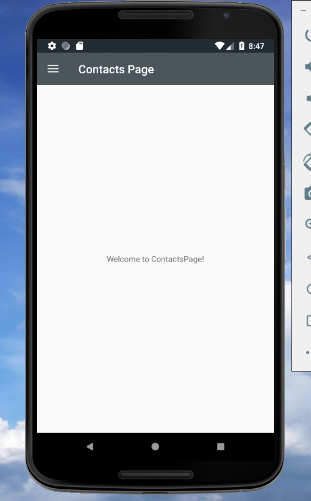
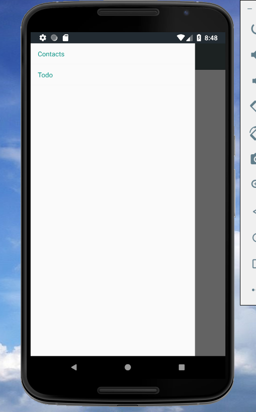
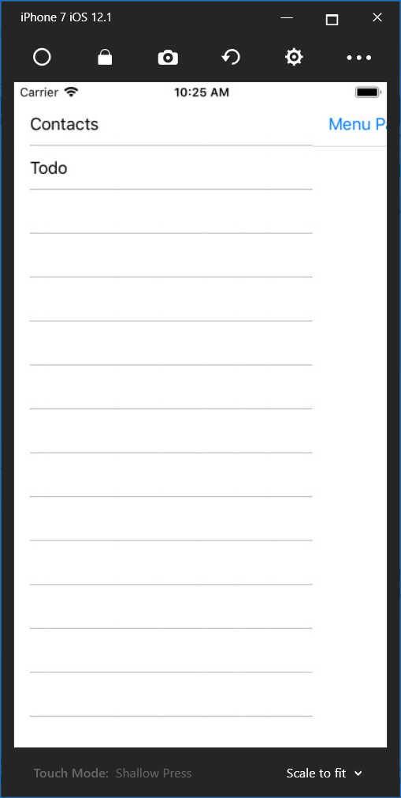

### Displaying the MasterPage and the DetailPage

Open the `MasterDetailViewModel.cs` file and override the `ViewAppearing` method, like this:

```c#
        public override async void ViewAppearing()
        {
            base.ViewAppearing();
            await _navigationService.Navigate<MenuViewModel>();
            await _navigationService.Navigate<ContactsViewModel>();
        }
```

The `ContactsPage` is used as the DetailPage when the app starts. Because we have specified the `MvxMasterDetailPagePresentation` attributes for `MenuPage` and `ContactsPage`, so MvvmCross will find the correct position to show them. Now we can launch the app for three platforms:

Android:





The default view is good. Xamarin.Forms automatically adds a hamburger icon button on the top left of the page. When we click the button, the MenuPage shows, but there is no page header. We will adjust the UI later.

iOS:




The default view of iOS is different with Android. There is no hamburger icon on the page. Another issue about the header bar of the MenuPage is the same with Android. It seems like that we need to add a hamburger icon and show the head bar. We will do it later.

UWP:


What happened? The MasterPage shows automatically and there is no default hamburger button. 

For details about the MasterDetailPage navigation behavior, please read it here: [MasterDetailPage Overview](https://docs.microsoft.com/en-us/xamarin/xamarin-forms/app-fundamentals/navigation/master-detail-page#overview). According to the documentation, the master page should have a navigation bar that contains a button. But now we got some different results. Anyway, we can fix it by ourselves.

To fix the layout of UWP, just set the `MasterBehavior` property of the MasterDetailPage. It is an enum value which determines how the detail page will show in the MasterDetailPage. If you keep it as `Default`, it will show the DetailPage respectively for different platforms. That is why we got different results.

Open the `MasterDetailPage.xaml` file in the MvxFormsMasterDetailDemo.UI project. Add the `MasterBehavior` property in the Page definition and set it as `Popover`, which means the DetailPage will cover or partially cover the MasterPage:

```xaml
<?xml version="1.0" encoding="utf-8" ?>
<views:MvxMasterDetailPage xmlns="http://xamarin.com/schemas/2014/forms"
             xmlns:x="http://schemas.microsoft.com/winfx/2009/xaml"
             x:Class="MvxFormsMasterDetailDemo.UI.Pages.MasterDetailPage"
             xmlns:views="clr-namespace:MvvmCross.Forms.Views;assembly=MvvmCross.Forms"
             xmlns:viewModels="clr-namespace:MvxFormsMasterDetailDemo.Core.ViewModels;assembly=MvxFormsMasterDetailDemo.Core"
             x:TypeArguments="viewModels:MasterDetailViewModel" MasterBehavior="Popover">

</views:MvxMasterDetailPage>
```

To see the effect, run the UWP project and it looks like this:


Now it has the default hamburger button on the left top of the page. Run the Android and the iOS projects to make sure everything is not broken by the slight change. You might notice that there are still some differences between these three platforms. For example, the UWP project has the header bar, but Android and iOS don't. The Android and UWP have the default hamburger button, but iOS doesn't. We will fix them later.